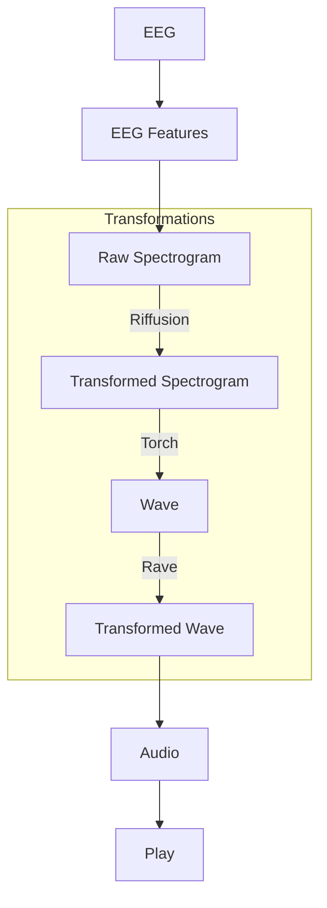

# brain2music
A Python and SD pipeline to convert EEG data to music in real time

## Pipeline Overview


Here is a mermaid diagram for the pipeline in the code you provided:



## Setup

### Install packages

```commandline
pip install -r requirements.txt
```

### Install PyTorch

1. Go to PyTorch website https://pytorch.org/.
1. Scroll down to installation instructions.
1. Select Stable build, your OS, package manages (ex.: Pip), language=Python, CUDA or CPU. 
1. Copy the installation command and run it in a shell/cmd in root project folder

You can check if you have CUDA by running in cmd and looking at the top right corner for "CUDA Version":

```
nvidia-smi
```

### Setup Rave (optional)

Download models from: https://acids-ircam.github.io/rave_models_download.

Put them into `/models`.